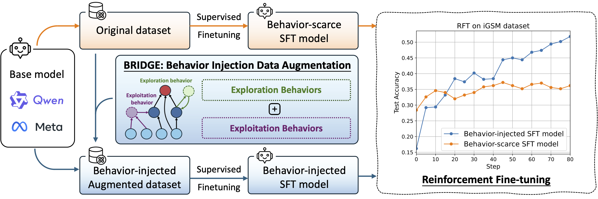

<br>
<p align="center">
<h1 align="center">
<strong>Behavior Injection: Preparing Language Models for Reinforcement Learning
</strong>
</h1>
</p>

## Overview
This repo provides an official implementation of *Behavior Injection: Preparing Language Models for Reinforcement Learning*. In this paper, we analyze the training per-step influence in RL finetuning and identify two key factors: (1) rollout accuracy, and (2) data co-influence, which quantifies how much the training data affects performance on other samples. We then propose to inject *exploration* and *exploitation* behaviors to prepare LLM for reinforcement learning finetuning.

<p align="center">
    
</p>

## Installation
1. We use Anaconda or Miniconda to manage python environment.
2. Create conda env,
    ```
    cd Bridge-LLM-reasoning
    conda create -n bridge python=3.10
    conda activate bridge
    ```
3. Install PyTorch according to your platform and cuda version, we use pytorch 2.6.0 with CUDA 12.4 here:
    ```
    pip install torch==2.6.0 torchvision==0.21.0 torchaudio==2.6.0 --index-url https://download.pytorch.org/whl/cu124
    ```
4. Install flash attention and vllm (we use 0.8.1),
    ```
    pip install flash-attn --no-build-isolation
    pip install vllm==0.8.1
    ```
5. Install iGSM-reasoning,
    ```
    cd iGSM-reasoning
    pip install -e .
    ```
    See [iGSM-reasoning/README.md](iGSM-reasoning/README.md) for detailed introduction of iGSM-reasoning.

6. Install simple VeRL (it is mainly derived from [VeRL](https://github.com/volcengine/verl), our main modifications are to simplify some codes):
    ```
    cd ../simple_verl
    pip install -e .
    ```

7. Login wandb and huggingface:
    ```
    wandb login
    huggingface-cli login
    ```

## Prepare iGSM dataset
We will prepare the dataset for both SFT and RL training. 
1. Go to the first level directory `Bridge-LLM-reasoning/`,
    ```
    cd ..
    ```
2. Generate datasets for SFT and RL: run
    ```
    experiment/process_data/data_generation.sh
    ```
    It will make dir `data/iGSM` and save the dataset in the dir.
3. Preprocess them and Convert them to `.parquet` file: run
    ```
    experiment/process_data/preprocess_igsm_data.sh
    ```
    The data preprocessing includes adding system prompt, applying SFT query and answer templates and other miscs.


## Run SFT and RL experiments
We suppose the experiment is run on a 2xA100(80G) server. Run experiments (SFT + RL) by
```
experiment/run_qwen2.5-1.5B-igsm.sh
```
You can use other scripts to run with other models. It includes two parts:
1. SFT training.
    The model will be saved to [model/sft](model/sft) dir. Remember to modify training data path if you use another one.
2. RL training.
    The model will be saved to [checkpoints/{project_name}](checkpoints) dir. You may need to convert the `.pt` files to `.safetensors` when using vllm for inference or pushing it to Huggingface.

You can also 
- modify batch_size like `xxx_batch_size_per_gpu` according to the memory usage.
- decrease `gpu_memory_utilization` if GPU memory is not enough.
- offload parameter / optimizer if GPU memory is still not enough, but it will significantly slow down the experiment.
- un-comment `export VLLM_ATTENTION_BACKEND=XFORMERS` at the beginning of the script if you encounter vllm bugs on V1 engine, then we will use engine V0 for inference.

## Evaluation
Currently, we manually run vllm inference from the checkpoints. 
See [evaluation readme.md](simple_verl/scripts/evaluation/readme.md) for instructions.