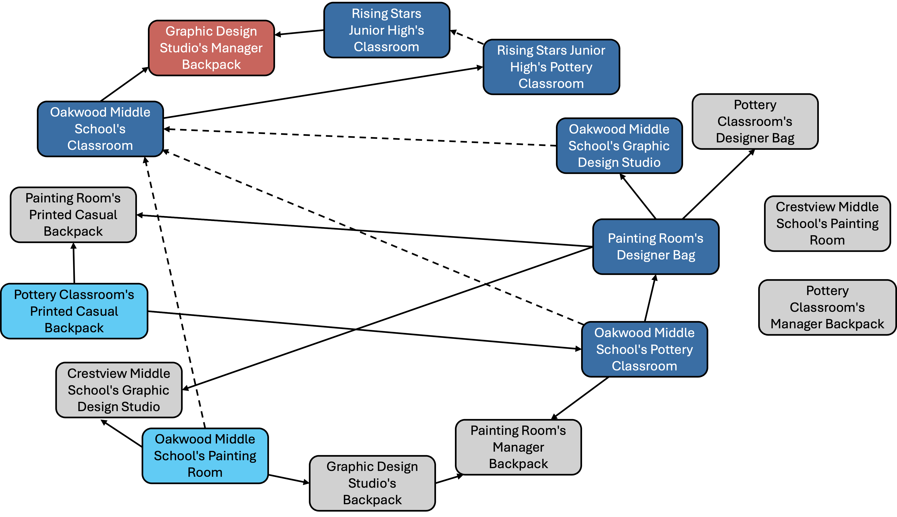

# iGSM-reasoning: a LLM reasoning task built on iGSM

## Installation
```
cd iGSM-reasoning
pip install -e .
```

You can generate a dataset by
```
python scripts/generate_dataset.py [--flags]
```
See [generate_dataset.py](scripts/generate_dataset.py) for more details of flags.

## Our main modifications
Our main modifications on original iGSM[1] are as follows:
- We remove the modulo operation in all computation steps because we observe that it's harder for (small) LLM to compute modulo operation than calculation without modulo.
- We filter out the queries whose ground-truth answers are out of a scope $[-K,K]$ (you can customize the threshold $K$).
- We rewrite the answer template. The original answer template is 
    ```
    Define [node name] as [a random letter], then [the random letter] = [... computation equations]
    ```
    The new answer template increases the answer diversity while keeping the logic of problem-solving (i.e., the order of node selection) and computation details. Meanwhile, the new template makes it easier and more fluent to add exploratory and exploitative behaviors.

## Example of iGSM-reasoning

We consider a iGSM problem based on the following DAG
<p align="center">
    
    <br>
    <em>Figure 1: DAG representation of an iGSM task. </em>
</p>
The red, light blue, dark blue, and gray rectangles mean the target, leaf, intermediate, and redundant nodes, respectively. The solid arrow indicates the explicit dependency which is explicitly given in query while the dash arrow means the implicit dependency which needs to be inferred by LLM. See original paper[1] for more details of DAG construction.

The demonstration query  is:
```
The number of each Graphic Design Studio's Manager Backpack equals the difference of each Rising Stars Junior High's Classroom and each Oakwood Middle School's Classroom.
The number of each Painting Room's Designer Bag equals 0 more than each Oakwood Middle School's Pottery Classroom.
The number of each Painting Room's Printed Casual Backpack equals 9 more than the sum of each Painting Room's Designer Bag and each Pottery Classroom's Printed Casual Backpack.
The number of each Crestview Middle School's Graphic Design Studio equals the difference of each Painting Room's Designer Bag and each Oakwood Middle School's Painting Room.
The number of each Pottery Classroom's Designer Bag equals each Painting Room's Designer Bag.
The number of each Pottery Classroom's Manager Backpack equals 0.
The number of each Pottery Classroom's Printed Casual Backpack equals 1.
The number of each Rising Stars Junior High's Pottery Classroom equals 2 times each Oakwood Middle School's Classroom.
The number of each Oakwood Middle School's Painting Room equals 6.
The number of each Crestview Middle School's Painting Room equals 5.
The number of each Painting Room's Manager Backpack equals 0 more than the sum of each Graphic Design Studio's Backpack, each Oakwood Middle School's Pottery Classroom and each Oakwood Middle School's Painting Room.
The number of each Oakwood Middle School's Pottery Classroom equals 5 times each Pottery Classroom's Printed Casual Backpack.
The number of each Oakwood Middle School's Graphic Design Studio equals 8 more than each Painting Room's Designer Bag.
How many Manager Backpack does each Graphic Design Studio have?
```

Its corresponding vanilla answer is
```
Let's compute the answer step by step.
- According to the information given, the number of each Pottery Classroom's Printed Casual Backpack is 1. Let's denote it as S. So S = 1.
- Next, let Q represent the number of each Oakwood Middle School's Pottery Classroom. Then Q = 5 * S = 5 * 1 = 5.
- Now, we can find the number of each Painting Room's Designer Bag. Let's denote it as U. Then U = 0 + Q = 0 + 5 = 5.
- We can then calculate the number of each Oakwood Middle School's Graphic Design Studio. Let it be m. Then m = 8 + U = 8 + 5 = 13.
- The number of each Oakwood Middle School's Painting Room is 6. Let's denote it as W. So W = 6.
- Then, let's denote the number of each Oakwood Middle School's Classroom as v. Then v = m + Q + W = 13 + 5 + 6 = 24.
- We can then calculate the number of each Rising Stars Junior High's Pottery Classroom. Let it be B. Then B = 2 * v = 2 * 24 = 48.
- Now, we can find the number of each Rising Stars Junior High's Classroom. Let it be p. Then p = B = 48.
- Next, let y represent the number of each Graphic Design Studio's Manager Backpack. Then y = p - v = 48 - 24 = 24.
Thus, the answer is 24.
```

We can inject behaviors to the answers to prepare the trained LLM for reinforcement finetuning.

```diff
    Let's compute the answer step by step.
    ...
    - The number of each Oakwood Middle School's Painting Room is 6. Let's denote it as W. So W = 6. 
-   - Then, let's denote the number of each Oakwood Middle School's Classroom as v. Then v = m + Q + W = 13 + 5 + 6 = 24.
+   - Then, let's denote the number of each Oakwood Middle School's Classroom as v. Then v = m + Q + W = 13 + 5 + 6 = 18 + 6 = 24.
    ...
+   - Then, let's denote the number of each Graphic Design Studio's Manager Backpack as y. But we haven't calculated the number of each Rising Stars Junior High's Classroom yet, thus the value of y is still unknown.
    ...
-   - Next, let y represent the number of each Graphic Design Studio's Manager Backpack. Then y = p - v = 48 - 24 = 24.
+   - Now, we can find the number of each Graphic Design Studio's Manager Backpack. Remember that it has been denoted as y. We know that it equals the difference of each Rising Stars Junior High's Classroom and each Oakwood Middle School's Classroom. Then y = p - v = 48 - 24 = 24.
    Thus, the answer is 24.
```
The new behaviors correspond to *subgoal computation*, *reflection* and *information analysis*.


[1] Ye, Tian, et al. "Physics of language models: Part 2.1, grade-school math and the hidden reasoning process." The Thirteenth International Conference on Learning Representations. 2024.